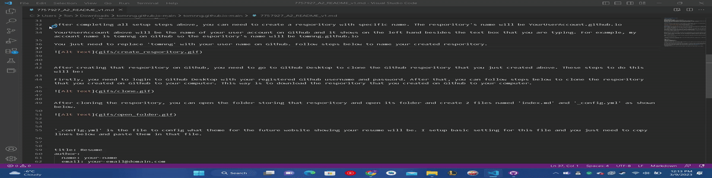

**HOW TO HOST YOUR RESUME ON GITHUB**

**AUDIENCE PROFILE**

Audience: CS Student
Venue: README on Github Pages
Purpose: Explain how to host a resume on Github Page.
Additional purpose: Introduce and demonstrate the principles of Andrew Etter's
book Modern Technical Writing
Desired Reaction: The person reading this README will understand how to host their resume using Markdown and Github
Vocabulary: Simple and not too technical so user without too much prior knowledge can follow.
Tone: Polite and Casual to make audience feel comfortable while reading.

**PRESEQUISITES**

Firstly, to create your resume and have it on the internet as a static website, you need to use Github Desktop, Github website and Visual Studio Code.

[Click here to download Visual Studio Code.](https://code.visualstudio.com/download)

[Click here to download GitHub Desktop.](https://desktop.github.com)

[Click here to login or sign up account on Github.](https://github.com/login)

**INSTRUCTIONS**
After setting up everything above, you can [click here to login to your registered Github Account.](https://github.com/login)

After you login to your Github Account, you need to create a new resporitory. This resporitory is place where we will put your resume here and I will explain later. To create a new resporitory, you can follow step shown as below here:

After completing all setup steps above, you can need to create a resporitory with specific name. The resporitory's name will be YourUserAccount.github.io

YourUserAccount above will be the name of your user account on Github and it shows on the left hand besides the text box that you are typing. For example, my account name is tomnng on Github so the esporitory's name will be tomnng.github.io

You just need to replace 'tomnng' with your user name on Github. Follow steps below to name your created resporitory.

After creating that resporitory on Github, you need to go to Github Desktop to clone the Github resporitory that you just created above. These steps to do this will be:

Firstly, you need to login to Github Desktop with your registered Github username and password. After that, you can follow steps below to clone the resporitory that you created on Github to your computer. This way is to download the resporitory that you created on Github to your computer.

After cloning the resporitory, you can open the folder storing that resporitory and open its folder and create 2 files named 'index.md' and '_config.yml' as shown below.

'_config.yml' is the file to config what theme for the future website showing your resume will be. I setup basic setting for this file and you just need to copy lines below and paste them in that file.

title: Resume
author:
  name: your-name
  email: your-email@domain.com
description: "settings for website"
remote_theme: jekyll/minima

'index.md' file is the file that you want to type information for your resume. You can use Visual Studio Code software that you installed to open to edit it. You can open the 'index.md' file by follow this step. You need to go to folder where you keep your Github resporitory:

With Visual Studio Code, you can type things that you want to include in your resume such as your name, your email, work experience, etc. To learn more about the format of how your website hosting your resume will look like, you can install Markdown Preview Enhanced in Visual Studio Code. This one is an extension to allow you to view your resume as website look while you are editting. You can follow step below to install Markdown Preview Enhanced:

After the extension is installed, you can preview how your 'index.md' file will look like in the future website, you need to type short cut  'cmd-shift-v or ctrl-shift-v' to view your previewed Markdown file as website look. The pop up preview window will show as below:

After you feel comfortable with your how your resume preview look, you can sync its content on your Github account by following steps below:

In the next step, you can login to your Github account at https://github.com/login and follow steps below and you can see the changes on the your created resporitory with your updated 'index.md' file and '_config.yml' file:

Now, your website on Github is ready. Github will convert your 'index.md' file in the back with Jekyll to show your static website.Normally, the website will be ready within several minutes. However, sometimes it takes more time so be patient to wait. Finally, you can view your hosted resume at the link:

YourUserName.github.io     where YourUserName is your Github name. In my case, my Github name is tomnng  so my hosted resume website link is: tomnng.github.io

If you do not know what your Github name, you click on top right icon as picture below to see your Github name:

